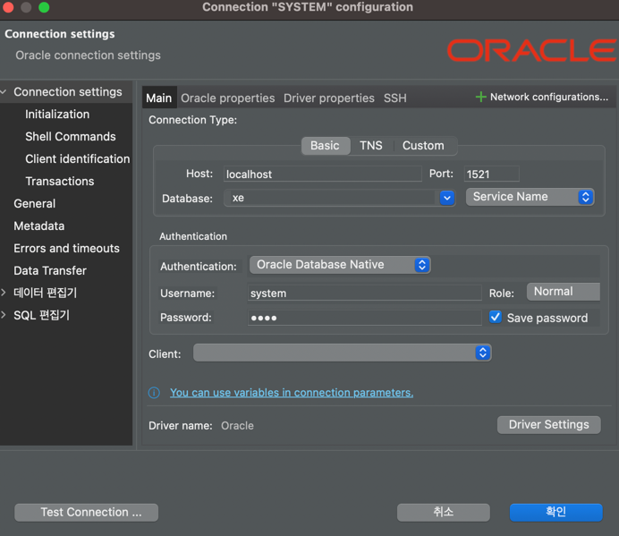
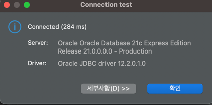

## Docker 설치 
https://docs.docker.com/desktop/install/mac-install/ \
위 링크에서  [Docker Desktop for Mac with Apple silicon] 을 다운로드 받아서 설치해 줍니다.

또는 Homebrew를 통해서 설치할 수 있습니다.
``` bash
brew install --cask docker
```

## Colima 설치
Oracle 이 Intel 칩에서만 가동되고 M1에서는 돌아가지 않는 문제점을 해결하기 위해서는 Colima를 설치해야됩니다.
Colima는 Docker Desktop을 대체할 수 있는 프로그램입니다.

Homebrew를 통해서 설치할 수 있습니다.

``` bash
brew install colima
```
설치가 끝나면 colima를 x86_64 환경으로 실행합니다.
``` bash
colima start --memory 4 --arch x86_64
```

Colima를 사용할 때는 Docker의 context를 변경해야 합니다.

docker context ls 명령어를 통해서 현재 context를 확인할 수 있습니다.
``` 
NAME                TYPE                DESCRIPTION                               DOCKER ENDPOINT                                 KUBERNETES ENDPOINT   ORCHESTRATOR
colima *            moby                colima                                    unix:///Users/lim/.colima/default/docker.sock                         
default             moby                Current DOCKER_HOST based configuration   unix:///var/run/docker.sock                                           
desktop-linux       moby                Docker Desktop                            unix:///Users/lim/.docker/run/docker.sock                             

```

colima context를 사용하도록 변경해 줍니다.

``` bash

```bash
docker context use colima
```


## 오라클 설치 
colima 설치를 완료 했으면, 이제 오라클을 설치해야 합니다.

gvenzl/oracle-xe 이미지를 사용해서 설치 해보겠습니다.

docker-compose.yml 파일을 만들어 줍니다.

``` bash
``` yml
version: '3'
services:
  oracle:
    restart: unless-stopped #컨테이너가 비정상적으로 종료되었을 때 자동으로 재시작
    container_name: oracle2
    environment:
      - ORACLE_PASSWORD=pass #system 계정의 비밀번호
    ports:
      - 1521:1521
    image: gvenzl/oracle-xe
```

docker-compose.yml 파일을 실행해 줍니다.
``` bash
docker-compose up -d
```

docker ps 명령어를 통해서 컨테이너가 실행되었는지 확인해 줍니다.
``` bash
docker ps
```

```
CONTAINER ID   IMAGE              COMMAND                   CREATED       STATUS       PORTS                                       NAMES
f0e56e020eef   gvenzl/oracle-xe   "container-entrypoin…"   3 hours ago   Up 3 hours   0.0.0.0:1521->1521/tcp, :::1521->1521/tcp   oracle
```

컨테이너가 정상적으로 실행되었습니다.

## 오라클 접속

오라클 접속을 위해서는 sqlplus를 사용해야 합니다.

``` bash
docker exec -it oracle sqlplus system/비밀번호 #system 계정으로 접속
```
```
SQL*Plus: Release 21.0.0.0.0 - Production on Fri Nov 10 12:47:30 2023
Version 21.3.0.0.0

Copyright (c) 1982, 2021, Oracle.  All rights reserved.

Last Successful login time: Fri Nov 10 2023 10:20:11 +00:00

Connected to:
Oracle Database 21c Express Edition Release 21.0.0.0.0 - Production
Version 21.3.0.0.0

SQL> 

```
접속에 성공했습니다.

dbeaver를 통해서도 접속해 보겠습니다.




접접속에 성공했습니다.


이제 M1 맥에서도 오라클을 사용할 수 있게 되었습니다.

## 정리
가장 중요한 점은 M1 맥에서 오라클을 사용하기 위해서는 Colima를 사용해야 한다는 것입니다.
Colima를 사용하면 Docker Desktop을 사용할 때와 동일하게 사용할 수 있습니다.


